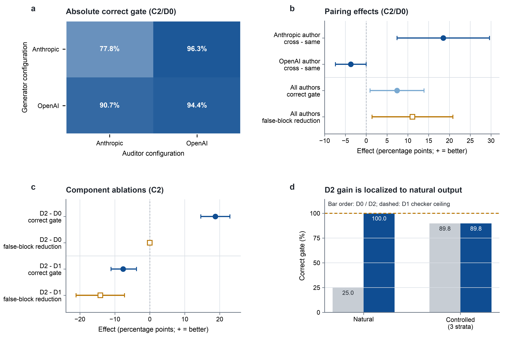
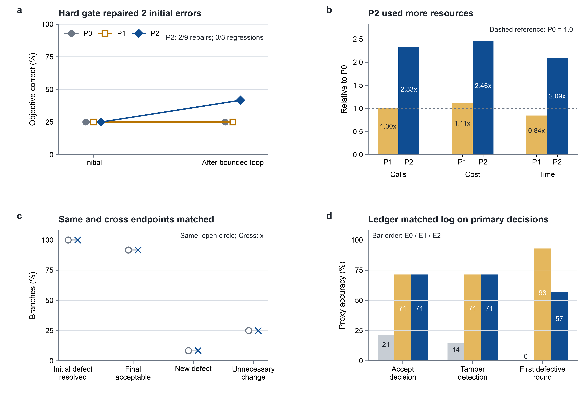

# CrossAudit

**A git-native, cross-vendor audit loop for agentic science.**

[](LICENSE)
[](CONTRIBUTING.md)
[](https://arxiv.org/abs/2608.28631)

[中文文档 →](README.zh-CN.md)

---

CrossAudit is a lightweight protocol for supervising autonomous AI research agents. Its premise is simple: **an AI scientist should not grade its own homework.** Every experiment increment produced by a *Generator* agent is independently audited by an *Auditor* agent **from a different model vendor**, against a versioned, human-authored rulebook — with git as the tamper-evident ledger, deterministic scripted checks as a model-free backstop, and humans brought in only when the loop cannot resolve itself.

CrossAudit is not a platform. It is a set of conventions and reference glue (GitHub Actions + small scripts) that any researcher can adopt with two repositories and two API keys.

## Why

Frontier "AI scientist" systems (DeepMind's AI co-scientist, Sakana's AI Scientist) already use internal critic agents — but critic and creator are typically the *same model or same vendor*, and LLM evaluators are known to systematically favour outputs resembling their own (self-preference bias). Shared training pipelines mean shared blind spots: the reviewer approves precisely the errors the author is prone to make. Meanwhile, most agentic-science pipelines keep their supervision trail in opaque platform logs, not in an artifact a third party can replay.

CrossAudit addresses both problems with three commitments:

1. **Heterogeneity** — the Auditor's model family must differ from the Generator's (e.g. Claude generates, a GPT-based auditor reviews). Non-overlapping blind spots are the point.
2. **Git-native ledger** — experiments, audit reports, verdicts, and escalations are all commits. The full supervision history is replayable, diffable, and citable. The audit rulebook (the *Constitution*) is itself versioned, and every report cites the exact rule IDs and Constitution commit it applied.
3. **Graded, escalation-based human oversight** — deterministic failures and hard inconsistencies (`BLOCKER`) stop the pipeline; methodological opinions (`ADVISORY`) do not. Humans are interrupted only on blockers that survive a bounded number of revision rounds, or when either agent explicitly requests a human.

A fourth, load-bearing rule: **determinism first.** Scripted, model-free checks (schemas, units, conservation laws, convergence assertions) run before any LLM reads anything, and *no language model may override them* in either direction.

## Architecture


**Roles**

| Role | Who | Responsibility |
|---|---|---|
| Generator | Agent, vendor A (e.g. Claude-based) | Produces experiment increments; pushes to the Science Repo; reviews audit reports |
| Deterministic Check Layer | Plain scripts, no LLM | Schema, units, convergence, conservation assertions; verdicts are non-overridable |
| Auditor | Agent, vendor B (e.g. GPT/Codex-based) | Audits each increment against the Constitution; commits a structured report to the Audit Repo |
| Human Principal | You | Authors the Constitution; receives escalations; final authority |

**Protocol (one experiment increment)**

1. Generator pushes an experiment increment to the **Science Repo**. Compute itself (e.g. jobs on cloud HPC) is decoupled — an audit outcome never interrupts running jobs.
2. The push triggers the **Audit Repo** (cross-repository dispatch) with the commit SHA.
3. The Audit Repo runs the **deterministic checks** first. Any hard failure short-circuits to a `BLOCKER` verdict.
4. The **Auditor** then reviews the increment against `AUDIT_RULES.md` (the Constitution), and commits a structured **audit report** — every finding tagged with a rule ID and a severity.
5. The verdict is dispatched back. `PASS` (advisories only) → the Generator proceeds. `BLOCKER` → the Generator must respond: revise, or dispute with grounds.
6. The revise/dispute loop is **bounded** (`max_rounds`, default 3). Rounds exhausted, or an explicit request by either agent → **escalate to the Human Principal** (GitHub Issue + notification). Only the affected increment halts.

## Quickstart

The [minimal example](examples/minimal/) is a fork-and-run pair of repositories:

```text
you/demo-science     ← Generator pushes here; contains crossaudit.yml
you/demo-audit       ← Constitution + auditor workflow + reports live here
```

1. Create the two repos from `examples/minimal/science-repo/` and `examples/minimal/audit-repo/`.
2. In each repo, add a fine-grained PAT as secret `CROSSAUDIT_DISPATCH_TOKEN` (scope: `contents:write` + `actions:write` on the sibling repo) so they can trigger each other.
3. In the audit repo, add your auditor key as secret `AUDITOR_API_KEY` (offline stub mode works without it — deterministic checks only).
4. Edit `crossaudit.yml` (vendors, `max_rounds`, severity policy) and `AUDIT_RULES.md`.
5. Push any change under `experiments/` in the science repo and watch the loop run: checks → audit report commit → verdict → pass or issue.

See [`examples/minimal/README.md`](examples/minimal/README.md) for the walkthrough.

## The Constitution

The Constitution (`AUDIT_RULES.md`) is the quality ceiling of the whole system — the Auditor is only as good as the rules it applies. CrossAudit therefore treats it like law, not documentation:

- Every rule has a stable ID (`CA-DATA-001`), a severity, and a *decidable* acceptance criterion.
- Reports must cite rule IDs and the Constitution's commit hash — an audit that cites nothing is invalid.
- Changes to the Constitution are themselves commits, so "which rules were in force for this experiment?" always has an answer.

Start from [`templates/AUDIT_RULES.md`](templates/AUDIT_RULES.md) and the [rule-writing guide](docs/audit-rules-spec.md).

## Deterministic check layer

[`checks/`](checks/) contains the reference runner and three example checks (metadata schema, unit/dimension sanity, convergence assertion). They are stdlib-plus-PyYAML Python, designed to be copied into your audit repo and extended. Their contract: exit non-zero ⇒ `BLOCKER`, and no LLM opinion can waive them. See [`docs/architecture.md`](docs/architecture.md#determinism-first) for why this layer exists (hint: two different LLMs can still share a blind spot when the literature itself is wrong).

## Adapting CrossAudit to your field

The reference example is flavoured as computational chemistry, but nothing in the protocol is chemistry-specific. CrossAudit fits any workflow where (a) research output lands in a repository as discrete increments, and (b) part of "correct" can be written down as rules. Swap the deterministic checks and the Constitution's domain sections; the loop, severity grading, and escalation policy carry over unchanged. Guidance: [`docs/architecture.md#adapting`](docs/architecture.md#adapting).

## Repository layout

```text
├── docs/                  architecture, rule-writing spec, FAQ, threat model
├── templates/             Constitution + audit report templates
├── checks/                deterministic check runner + example checks
├── examples/minimal/      fork-and-run two-repo demo (GitHub Actions)
└── diagrams/              architecture diagram (Mermaid source + SVG/PNG)
```

## Status

CrossAudit is a working protocol whose first live cycles are running in the author's own computational-chemistry pipeline (Claude-based generator, Codex-based auditor, compute on Alibaba Cloud HPC). The reference implementation here is deliberately minimal; issues and PRs are welcome — see [CONTRIBUTING.md](CONTRIBUTING.md).

A separately registered v4 execution-feasibility cohort has now run all seven
successor-study modules on six deterministic convenience tasks with model
proxies. Its successful Amendment 2 cohort completed 542/542 valid provider
calls at a known cost of USD 12.1504115 and was sealed on the network before
scoring. These are non-confirmatory, configuration-specific measurements, not a
general cross-vendor or product claim. Read the
[quantitative results](experiment/v4/FEASIBILITY-RESULTS.md) and the
[seven-point status contract](experiment/v4/SEVEN-POINT-COMPLETION.md). The
registered 120-task, human-adjudicated confirmatory study remains unrun.

### Sealed feasibility figures

[](paper/figures/figure5-v4-configuration-effects.pdf)

**Configuration and component effects.** The crossed C2/D0 cells retain both
Generator–Auditor directions, while the DCL panels show that the observed D2
gain is confined to natural outputs rather than the three controlled strata.
Intervals are descriptive whole-task bootstrap intervals over six convenience
tasks. [SVG](paper/figures/figure5-v4-configuration-effects.svg) ·
[Source data](experiment/v4/figures/source-data.csv)

[](paper/figures/figure6-v4-operational-tradeoffs.pdf)

**Operational trade-offs.** The hard gate repaired 2 of 9 initially wrong
research-text sessions but consumed more calls, cost, and provider time;
same- and cross-auditor whole-loop endpoints matched in this micro-cohort; and
the structured ledger matched, rather than exceeded, the ordinary log on the
primary proxy decisions. [SVG](paper/figures/figure6-v4-operational-tradeoffs.svg)
· [Source data](experiment/v4/figures/source-data.csv)

**Constitution exclusion.** Constitution contrasts are not plotted. The current
feasibility scorer filters the C0/C1/C2 comparison to `repeat == 0`, whereas the
registration states that C2 uses all three core repeats. Until that mismatch is
resolved prospectively, the existing values are repeat-0 implementation
diagnostics and cannot support a registered three-repeat Constitution-effect
claim.

## Citing CrossAudit

The protocol paper is [arXiv:2608.28631](https://arxiv.org/abs/2608.28631).
The published v1 source is preserved at release tag `paper-v1.0.0`; `paper/`
and `paper/HASHES.txt` now bind the replacement candidate that adds the sealed
v4 feasibility results. Use [`CITATION.cff`](CITATION.cff) for citation metadata.

## License

[MIT](LICENSE) © 2026 Zhaohe Dong

## Deployment note: making admission binding

The audit side posts a commit status `crossaudit/admission` on every audited science
commit. To turn notification into **enforcement**, enable branch protection on the
science repo's protected branch and mark `crossaudit/admission` as a required status
check; production/publication jobs should additionally verify a receipt via
`controller/verify_receipt.py --admit`. Use two distinct fine-grained tokens:
`SCIENCE_TO_AUDIT_TOKEN` (dispatch to audit repo) and `AUDIT_TO_SCIENCE_TOKEN`
(statuses + dispatch back). The legacy single `CROSSAUDIT_DISPATCH_TOKEN` still works
but shares credentials across the trust boundary — see `ROADMAP-R2.md` §8.
