# CrossAudit

**面向智能体科研（agentic science）的、以 Git 为账本的跨厂商审计环。**

[English →](README.md)

---

CrossAudit 是一套监督自主科研 AI 的轻量协议。出发点只有一句话：**AI 科学家不能自己给自己的作业打分。**"生成者"（Generator）agent 产出的每一个实验增量，都由**另一家厂商**的"审计者"（Auditor）agent 依据一份版本化的、由人类撰写的规则手册独立审计——Git 是全程防篡改的账本，确定性脚本校验是不依赖任何模型的兜底，人类只在环路自身无法解决时才被请出场。

CrossAudit 不是一个平台，而是一组约定加少量参考胶水代码（GitHub Actions + 小脚本）。任何研究者用两个仓库、两个 API key 即可采用。

## 为什么需要它

前沿的"AI 科学家"系统（DeepMind 的 AI co-scientist、Sakana 的 AI Scientist）内部虽有批评者 agent，但批评者与创作者通常是*同一模型或同一厂商*——而 LLM 评审者已被证明会系统性偏爱与自己风格相近的输出（自我偏好偏差）。共享的训练管线意味着共享的盲区：审稿人恰好会放过作者最容易犯的那类错误。同时，多数智能体科研管线的监督痕迹存在不透明的平台日志里，第三方无法重放。

CrossAudit 用三条承诺回应这两个问题：

1. **异源制衡（Heterogeneity）**——审计者与生成者必须来自不同模型家族（如 Claude 生成、GPT 系审计）。盲区不重叠正是意义所在。
2. **Git 原生账本（Git-native ledger）**——实验、审计报告、裁定、上报全部是 commit，监督史可重放、可 diff、可引用。审计规则手册（"宪法"）本身版本化，每份报告必须引用所依据的规则条目 ID 与宪法 commit 哈希。
3. **分级的、按需上报的人类监督**——确定性失败与硬性不一致（`BLOCKER`）阻断流程；方法学意见（`ADVISORY`）不阻断。只有当阻断项在有限轮修订内无法解决、或任一 agent 明确请求时，才打扰人类。

还有第四条承压规则：**确定性优先。** 模式化的、不含 LLM 的脚本校验（schema、单位量纲、守恒律、收敛断言）先于任何 LLM 运行，且**任何语言模型都无权推翻其结论**。

## 架构



**角色**

| 角色 | 是谁 | 职责 |
|---|---|---|
| 生成者 Generator | 厂商 A 的 agent（如 Claude 系） | 产出实验增量；push 到科研仓库；复核审计报告 |
| 确定性校验层 | 纯脚本，无 LLM | schema、单位、收敛、守恒断言；结论不可被推翻 |
| 审计者 Auditor | 厂商 B 的 agent（如 GPT/Codex 系） | 依宪法逐条审计；向审计仓库提交结构化报告 |
| 人类负责人 | 你 | 撰写宪法；接收上报；最终权威 |

**协议（一个实验增量的生命周期）**

1. 生成者向**科研仓库**push 一个实验增量。计算本身（如云端超算上的作业）与审计解耦——审计结果永不打断正在运行的作业。
2. push 触发**审计仓库**（跨仓库 dispatch，携带 commit SHA）。
3. 审计仓库先跑**确定性校验**，任何硬失败直接短路为 `BLOCKER` 裁定。
4. **审计者**再依据 `AUDIT_RULES.md`（宪法）逐条审查，并提交一份结构化**审计报告**——每条发现都标注规则 ID 与严重级别。
5. 裁定回传。`PASS`（仅有建议项）→ 生成者继续。`BLOCKER` → 生成者必须响应：修订，或有理有据地提出异议。
6. 修订/异议环路**有界**（`max_rounds`，默认 3）。轮次耗尽、或任一 agent 明确请求 → **上报人类负责人**（GitHub Issue + 通知）。只有受影响的增量被挂起。

## 快速上手

[最小示例](examples/minimal/) 是一对 fork 即用的仓库：

```text
you/demo-science     ← 生成者向这里 push；含 crossaudit.yml
you/demo-audit       ← 宪法 + 审计工作流 + 报告存放于此
```

1. 用 `examples/minimal/science-repo/` 与 `examples/minimal/audit-repo/` 建两个仓库。
2. 双方各加一个 fine-grained PAT 作为 secret `CROSSAUDIT_DISPATCH_TOKEN`（对对方仓库有 `contents:write` + `actions:write` 权限），使两仓可互相触发。
3. 审计仓库加 secret `AUDITOR_API_KEY`（不加也能跑离线 stub 模式——只做确定性校验）。
4. 按需修改 `crossaudit.yml`（厂商、`max_rounds`、严重级别策略）与 `AUDIT_RULES.md`。
5. 向科研仓库 `experiments/` 下 push 任意改动，观察环路运转：校验 → 审计报告 commit → 裁定 → 通过或开 Issue。

完整演练见 [`examples/minimal/README.md`](examples/minimal/README.md)。

## 宪法

宪法（`AUDIT_RULES.md`）是整个系统的质量上限——审计者的水平不会超过它所执行的规则。因此 CrossAudit 把它当法律而非文档对待：

- 每条规则有稳定 ID（`CA-DATA-001`）、严重级别，和一条*可判定的*验收标准。
- 报告必须引用规则 ID 与宪法 commit 哈希——不引用任何条目的审计无效。
- 宪法的修改本身也是 commit，"这次实验适用哪一版规则"永远有答案。

从 [`templates/AUDIT_RULES.md`](templates/AUDIT_RULES.md) 与[规则撰写指南](docs/audit-rules-spec.md)开始。

## 确定性校验层

[`checks/`](checks/) 提供参考运行器与三个示例校验（元数据 schema、单位量纲、收敛断言），Python 实现、仅依赖标准库加 PyYAML，可直接拷入你的审计仓库扩展。契约：退出码非零 ⇒ `BLOCKER`，且任何 LLM 意见不得豁免。为何需要这一层，见 [`docs/architecture.md`](docs/architecture.md#determinism-first)（提示：当文献本身就错时，两家 LLM 仍可能一起犯错）。

## 迁移到你的领域

参考示例以计算化学为背景，但协议本身与化学无关。只要满足：(a) 科研产出以离散增量落入仓库；(b) "正确"的一部分可以写成规则——CrossAudit 就适用。换掉确定性校验和宪法的领域章节即可，环路、分级、上报策略原样保留。指引见 [`docs/architecture.md#adapting`](docs/architecture.md#adapting)。

## 仓库结构

```text
├── docs/                  架构说明、规则撰写规范、FAQ、威胁模型
├── templates/             宪法与审计报告模板
├── checks/                确定性校验运行器 + 示例校验
├── examples/minimal/      fork 即用的双仓演示（GitHub Actions）
└── diagrams/              架构图（Mermaid 源文件 + SVG/PNG）
```

## 项目状态

CrossAudit 是一套已在作者本人计算化学管线中每日运转的工作协议（Claude 系生成者、Codex 系审计者、算力在阿里云超算）。本仓库的参考实现刻意保持最小化；欢迎 Issue 与 PR——见 [CONTRIBUTING.md](CONTRIBUTING.md)。

## 引用

Position paper 撰写中（arXiv 链接将更新于此）。在此之前请按 [`CITATION.cff`](CITATION.cff) 引用。

## 许可证

[MIT](LICENSE) © 2026 Zhaohe Dong

## 部署注记：让准入真正生效

审计侧会在每个被审计的科学提交上发布 commit status `crossaudit/admission`。要把
"通知"升级为**强制执行**：在科学仓库的受保护分支上启用分支保护，并把
`crossaudit/admission` 设为必需状态检查；生产/发表类任务还应通过
`controller/verify_receipt.py --admit` 核验回执。请使用两个相互独立的
fine-grained token：`SCIENCE_TO_AUDIT_TOKEN`（向审计仓库派发）与
`AUDIT_TO_SCIENCE_TOKEN`（回写状态与派发）。旧式单一
`CROSSAUDIT_DISPATCH_TOKEN` 仍可用，但它让凭证跨越了信任边界——见
`ROADMAP-R2.md` §8。
